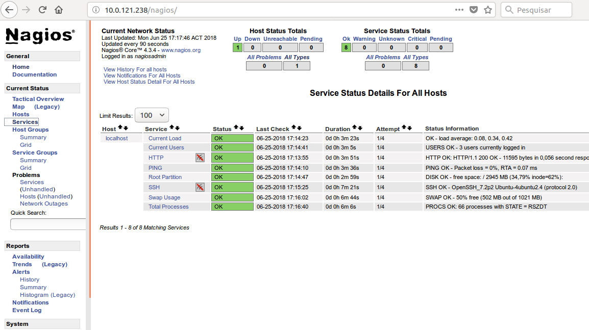

# Prática Nagios

Segui o tutorial, por ser de rede ja tive contato com essa ferramenta por esse motivo considerei fácil, nesta pratica realizei o monitoramento local de alguns serviços como HTTP e etc... Como ilustrado na figura a seguir:

