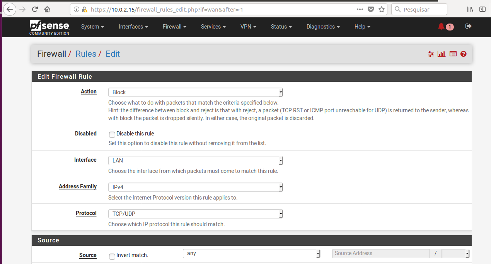
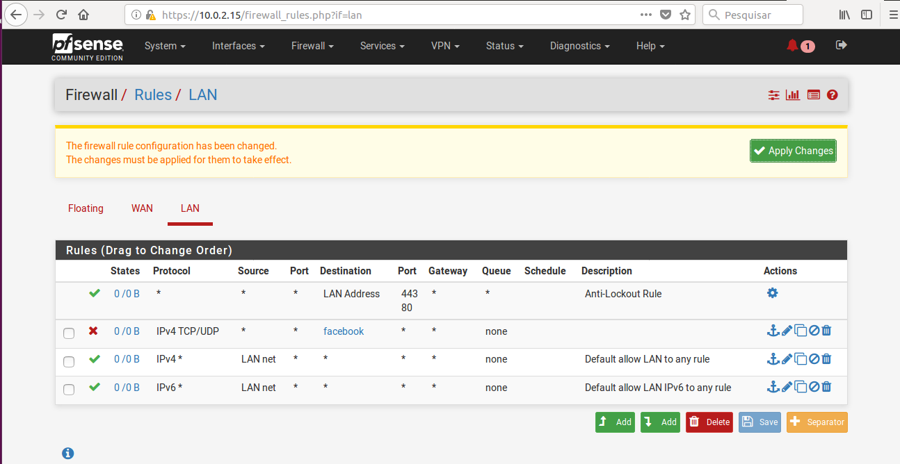
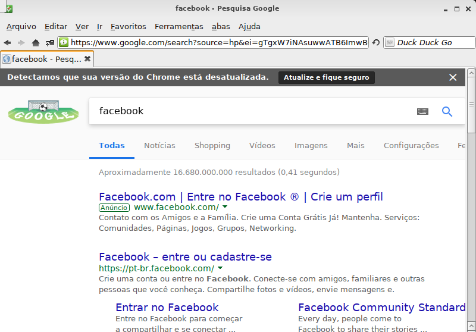
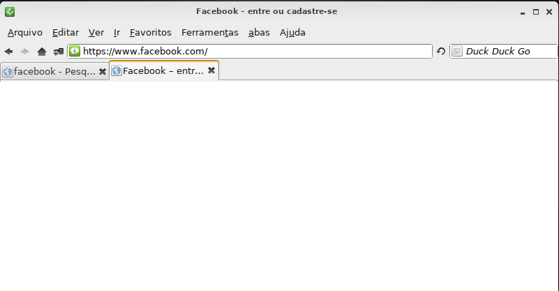

# Prática PFsense

Segui o tutorial, por ser de rede ja tive contato com essa ferramenta apesar de fazer um bom tempo que não tenho mais contato mais considerei fácil, nesta pratica foi solicitado o bloqueio do Facebook;

Foi criado um `Alias` contendo todos os links (FQDN) do Facebook para adicionarmos na regra como no passo a seguir, criamos uma regra de bloqueio:

Nesta figura ilustra a regra criada

Nesta figura demostramos que o navegador da maquina cliente possui intenet, pesquisamos no google por facebook:

Ja nesta figura podemos observar que o facebook não carrega na maquina cliente:

