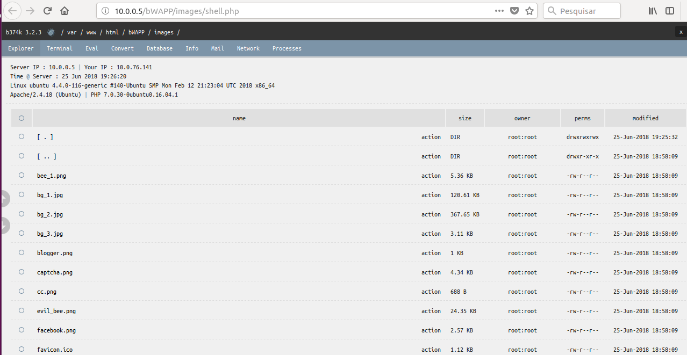
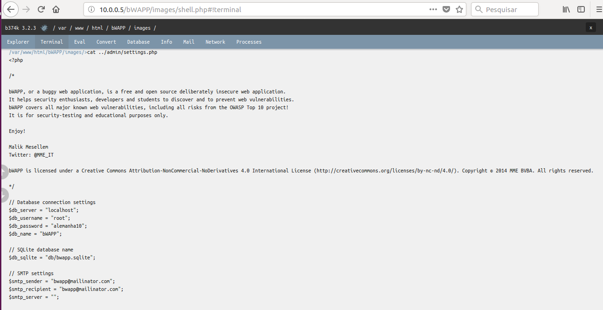

# Prática Remote File Inclusion

Segui o tutorial, Porem encontrei dificuldades para a instalação da ferramenta, foi a parte que mais tive dificuldade, já o restante por ser usuária de Linux não tive dificuldade.

Nesta figura ilustramos a ferramenta instalada e subimos o arquivo shell

Ja nesta imagem, foi dado um comando para mostrat o conteudo de um arquivo de configuração da ferramenta

