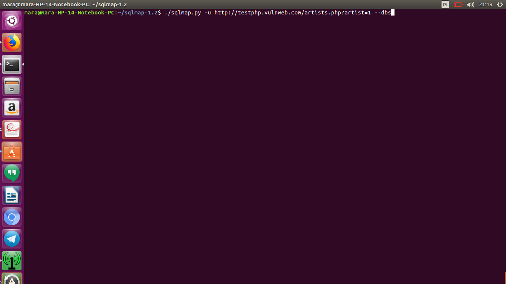
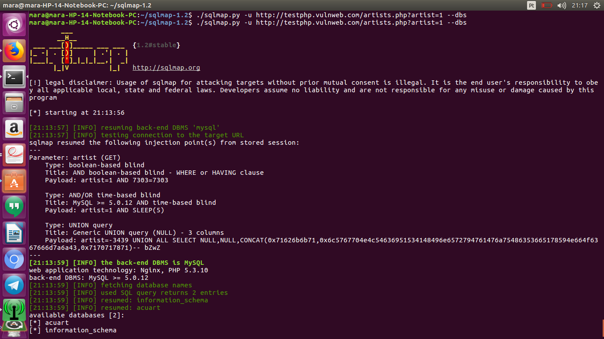
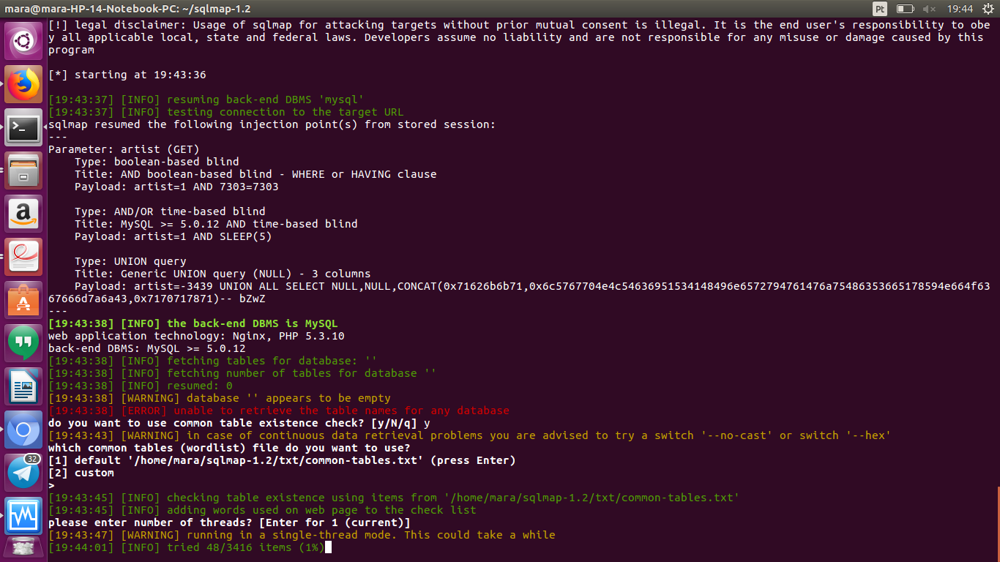
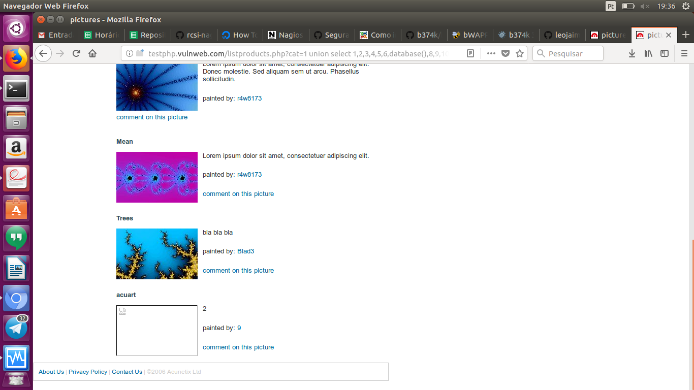
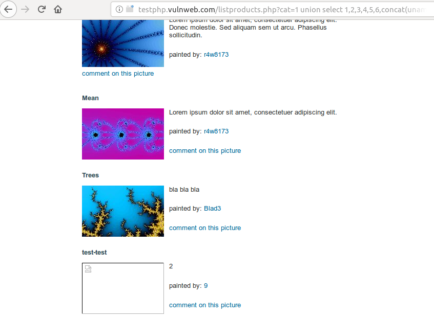

# Prática SQL Injection

Segui o tutorial, encontrei dificuldade com a ferramenta apresentada devido a mesma não conseguir realizar alguns passos, talvez tenha sido minha maquina a causadora dos erros ou algo do tipo pois utlizo a arquitetura x86 e que a mesma vem dificultando a realização de algumas práticas, porem os alunos apresentaram duas formas de realizar a atividade, uma era usando a ferramenta e a outra era de forma manual, então devido aos constantes erro no uso da ferramenta, realizei a atividade usando a forma manual.

Nesta figura ilustra os primeiros passos usando a ferramenta, o mesmo funcionou e foi exebido o banco do website

Comando:

Saida

A figura a seguir ilustra os erros ocasionado no uso da ferramenta, onde no passo a seguir deveria exibir as tabelas:

As figuras a seguir ilustra dois passos realizados na maneira manual:

Exibindo o Banco

Exbindo usuario e senha:

