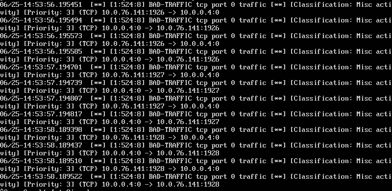
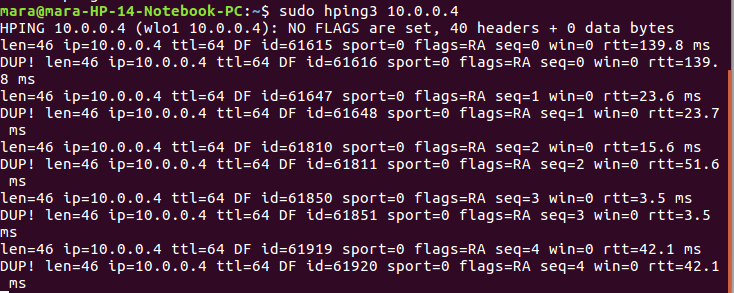

# Prática IDS Snort

Segui o tutorial, mais por falta de recursos foi impossivel utilizar uma maquina Windows como atacante, porém utilizei um utilitario do linux `hping3` apresentado por outro aluno o que possibilitou-me realizar esta pratica em um cenario todo linux.

Nesta figura ilustra o lado do servidor que usa o snort para escutar determinada interface.

Ja nesta imagem, apresenta o atacante.

