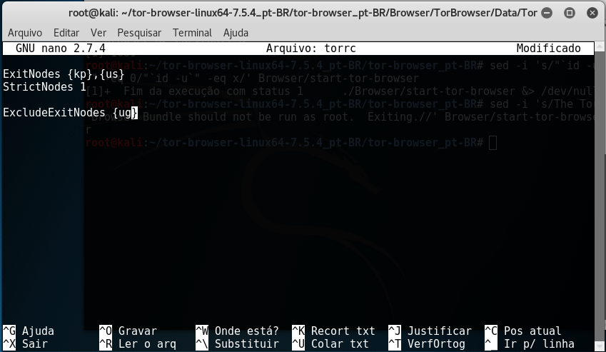
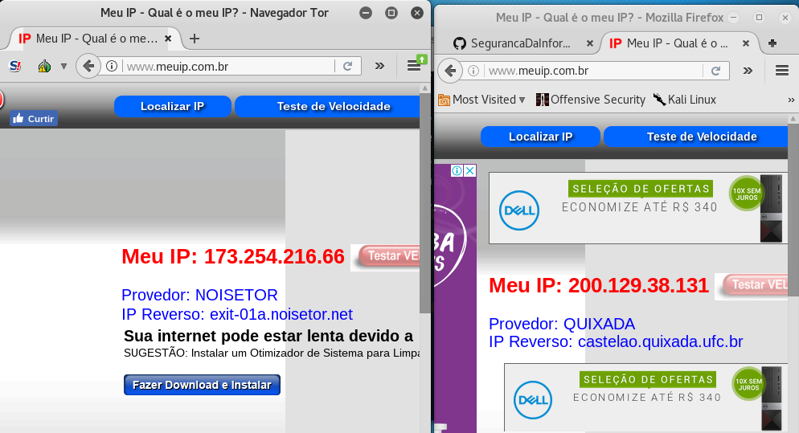
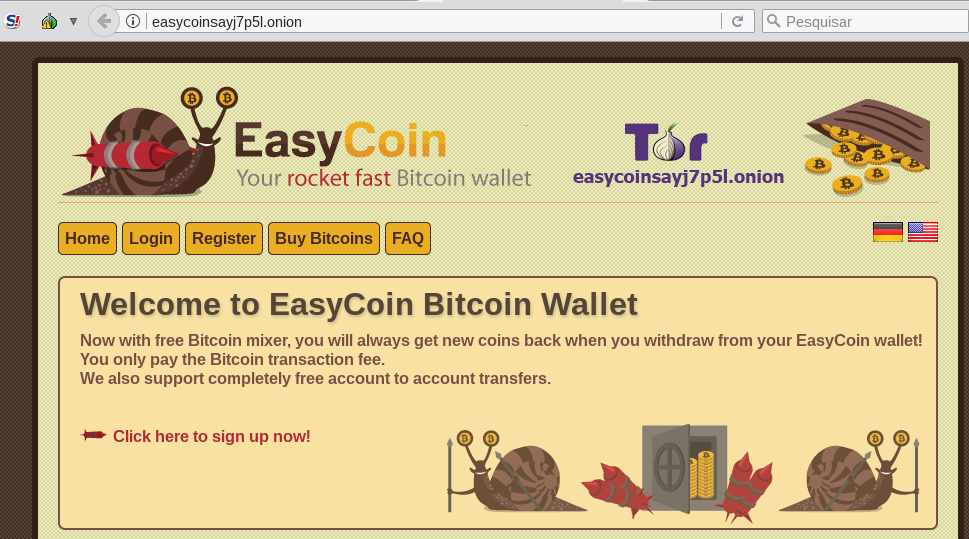

# Prática TOR

Esta prática era bem simples, porem foi dificultada devido a falta de um tutorial, mais o mesmo possui bastantes fontes que ensina configurar o TOR em ambientes linux.

Nesta figura foi realizada a etapa de montar a lista negra:

Ja nesta figura, foi realizada o teste em site que rastreia o IP, no lado esquerdo é demonstrado o acesso pelo TOR, ja do lado direito é apresentado o resultado do acesso sem uso de TOR:

Já o site da rede onion, acessei um site que é uma especie de carteira de uma criptomoeda.

